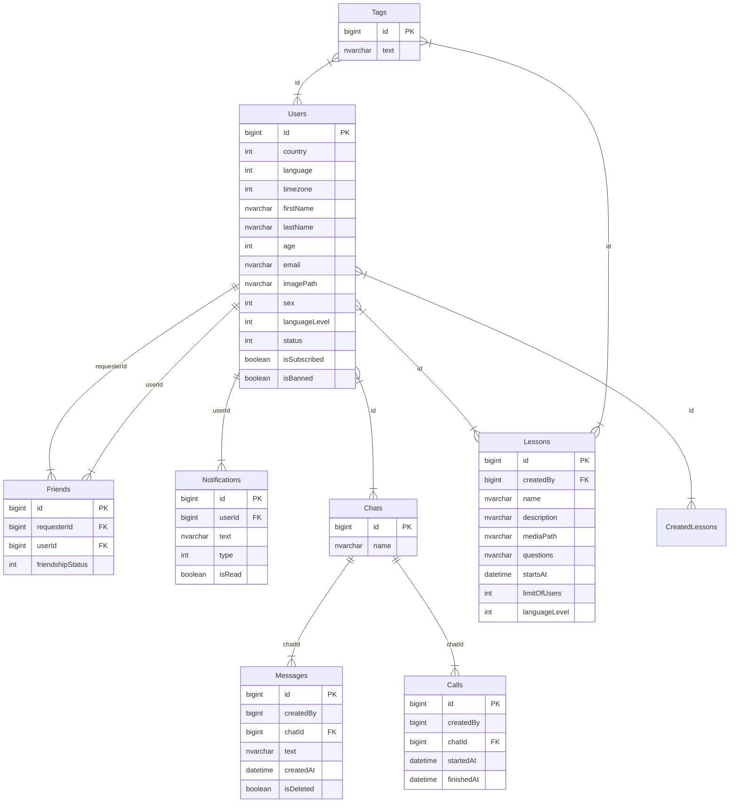

# INT20H | .NET | Angular | StudentHUB

**Technologies:**

Backend:

- Platform: .NET 8
- Network: REST
- Database: MS SQL Server, Entity Framework Core
- Cloud: Azure
- Other: JWT, Docker

Frontend:

- Angular
- HTML5/CSS3/SASS

## Links:

- [Website]()
- [Trello Board](https://github.com/users/bochka123/projects/4)

## Building sources

By default, apps run on the following ports:

| Application                 | Port |
|-----------------------------|------|
| StudentHUB.**WebAPI**       | 5000 |
| Angular CLI                 | 5050 |

## DB Schema

## Code quality

Make sure you read and follow [.NET Quality Criteria](TODO).
Also, there are some best practices for frontend development: [Angular](https://angular.io/guide/styleguide) and [Typescript](https://google.github.io/styleguide/tsguide.html)

#### Docker:

1. Make sure you have [Docker](https://www.docker.com) and [Docker Compose](https://docs.docker.com/compose/install).
2. Pull this repo to your machine.
3. You can build and run frontend and backend containers via `docker compose up -d` command.
5. Happy coding! :sunglasses:

#### Setup environment for local development:

1. Download and install [.NET 6 SDK](https://dotnet.microsoft.com/download).
2. It might be useful to have EF CLI. Install via command: _dotnet tool install --global dotnet-ef_
3. Download and install LTS version of [Node.js](https://nodejs.org/en/)
4. Install Angular-CLI via: _npm install -g @angular/cli_. _[What is Angular-CLI?](https://angular.io/cli)_

## Extensions for frontend development (required):

- ESLint (analysis tool that checks TypeScript\JavaScript code for readability, maintainability, and functionality errors)
- EditorConfig (helps maintain consistent coding styles for multiple developers working on the same project)

Some extra extensions which can significantly help to work with Angular:

- Angular Language Service (intelliSense for Angular templates)
- Angular Snippets
- Angular Schematics (working with Angular schematics via UI)

## Environment variables

This is a list of the required environment variables:

#### MSSQL Server

**CONNECTION_STRING** - MSSQL database connection string
**SA_PASSWORD** - MSSQL Server "SA" user password

#### Blob Storage

**CONNECTION_STRING** - Azure Blob Storage connection string
**ACCOUNT_KEY** Azure Blob Storage user password
